# Assessment Dashboard

It's a responsive web application built using React, Tailwind CSS to help manage assessments efficiently. The dashboard provides a user-friendly interface for managing and monitoring assessments. It streamlines the assessment process and offers a smooth user experience.

## Tech stack

- React
- Tailwind CSS
- CSS

#### Live link - [https://assessment-dashboard-nk.netlify.app/](https://assessment-dashboard-nk.netlify.app/)

### Desktop - 1440 x 1530
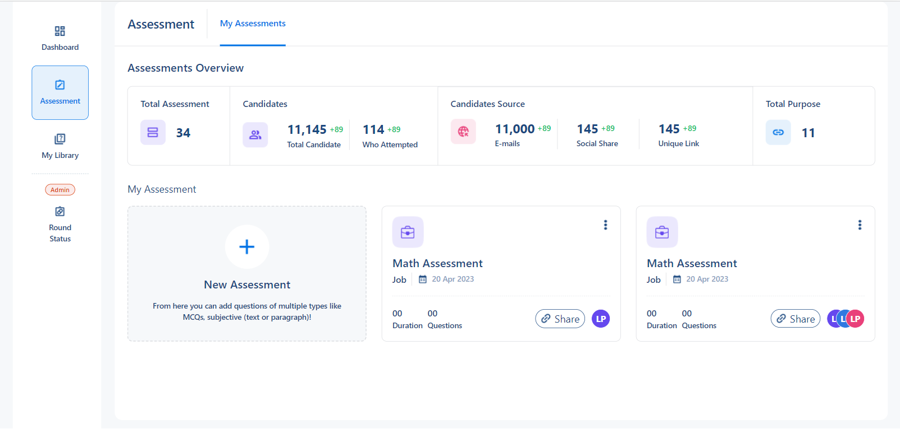

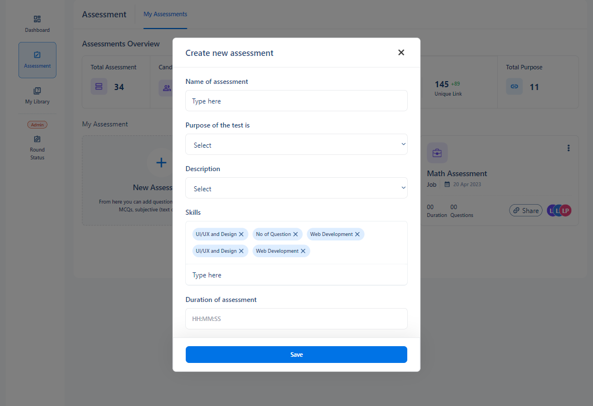

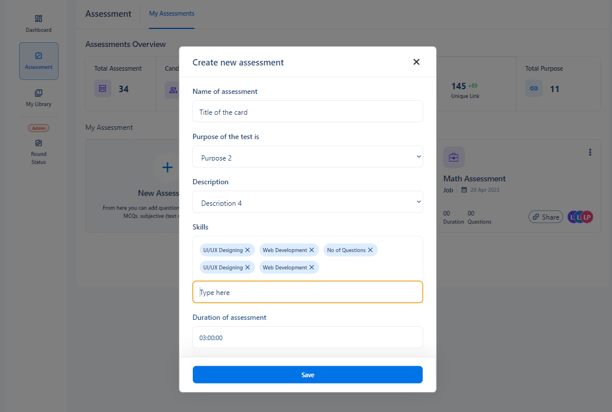

 

### Mobile - 375 x 678

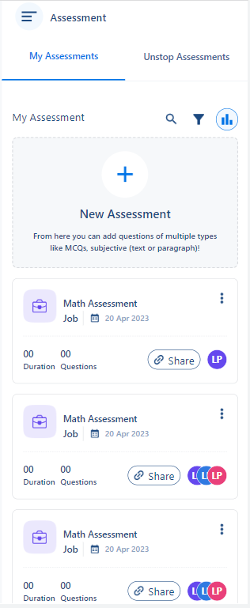
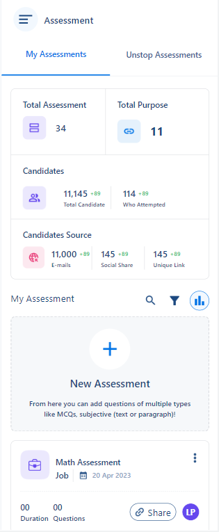

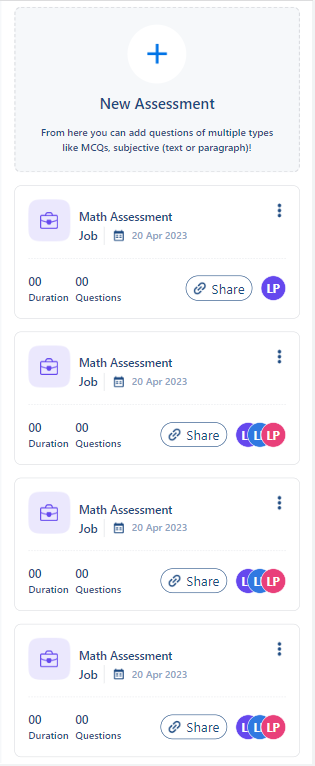
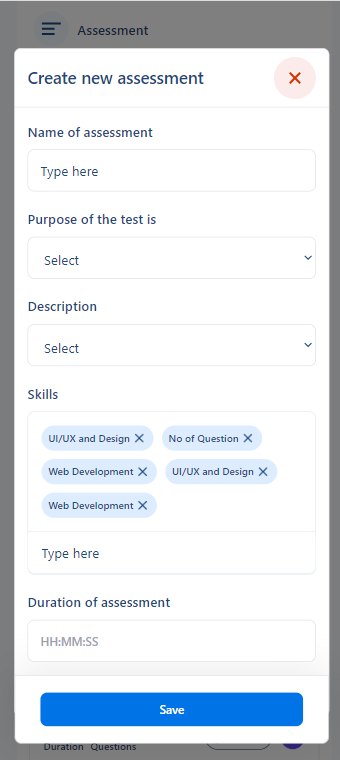

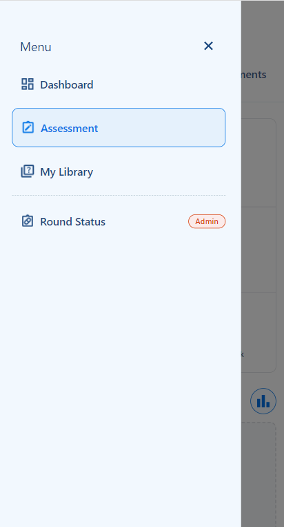

 

### Tablet - 768

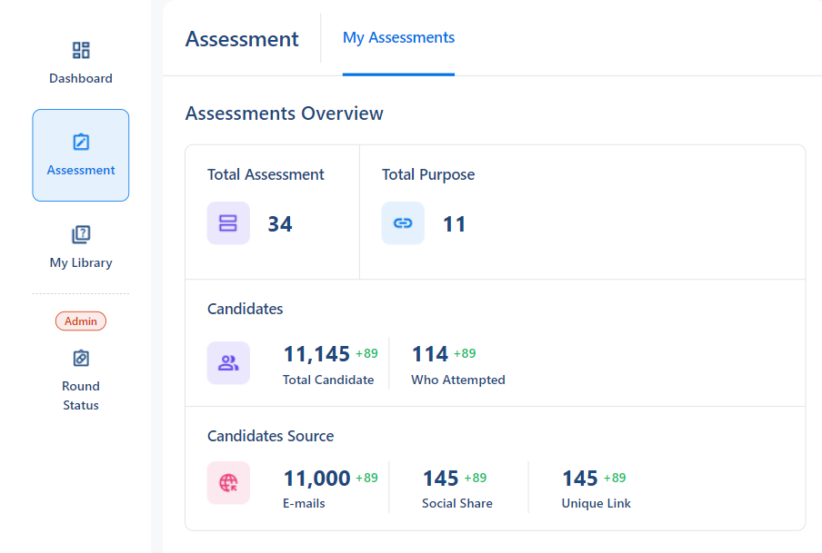

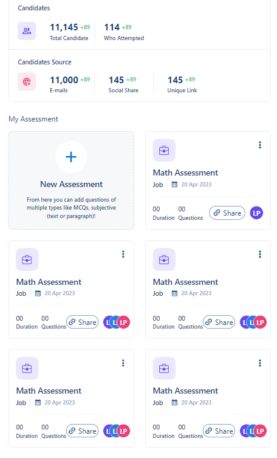

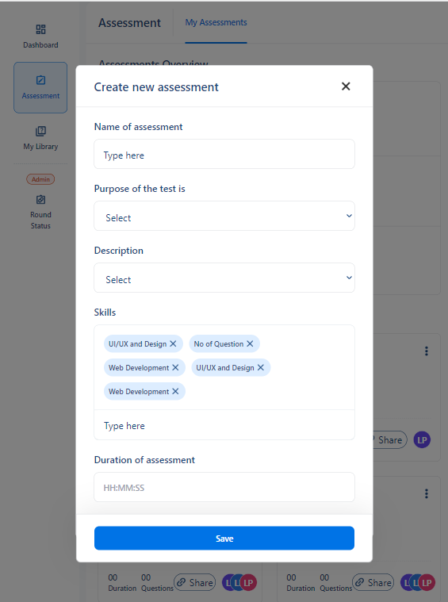

 
 

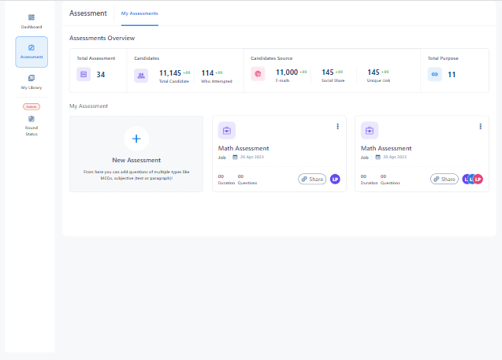

